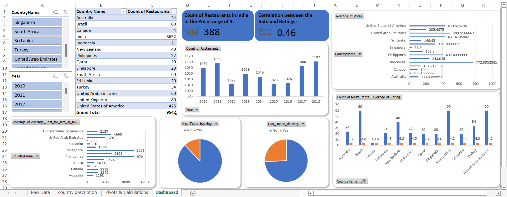

# Zomato Restaurant Expansion Strategy Dashboard [Excel]

## Overview
This repository contains a Power BI project that showcases a sales dashboard. The dashboard provides insights into sales performance, regional distribution, and product analysis.

A Strategic Approach to Restaurant Expansion

This project is a strategic analysis to guide the next steps in restaurant expansion. An overview of the restaurant data, covering key aspects such as geographical distribution, competition analysis, cuisine preferences, pricing dynamics, and more.

## Files
- `reports/Zomato_Restaurant_Expansion_Strategy.xlsx`: The Excel dashboard file.
- `data/Zomato_Data.xlsx`: The source data used for the report.

## Preview

## How to Use
1. Clone this repository.
2. Open `reports/Zomato_Restaurant_Expansion_Strategy.xlsx with Microsoft Excel.

## Data Sources
- The restaurants data was provided by the Newton School.
